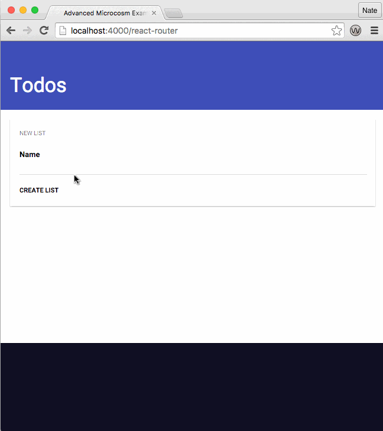

# Microcosm Debugger

A debugging tool for Microcosm. Work in progress!

## Usage

These steps will probably not work yet. But the gist of it:

```javascript
var Debugger = require('microcosm-debugger')

var app = new Microcosm()

app.addPlugin(Debugger)

app.start(function() {
  console.log("Commence debugging")
})
```

## What it looks like


