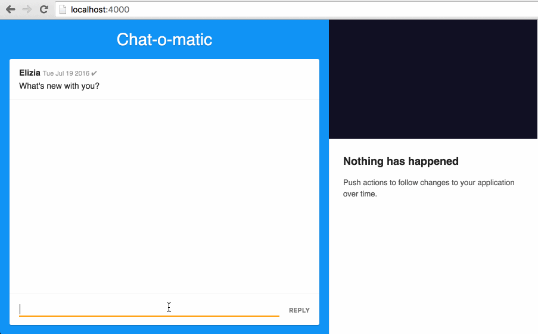

** Heads up!** This project is no longer maintained. We've moved all Microcosm debugger related work to a browser extension:

https://github.com/vigetlabs/microcosm-debugger

---

# Microcosm Debugger

A debugging tool for [Microcosm](https://github.com/vigetlabs/microcosm). 

## Usage

```shell
npm install microcosm-debugger
```

```javascript
import Debugger from 'microcosm-debugger'

// Enable history forever
const app = new Microcosm({ maxHistory: Infinity })

Debugger(app)
```

## What it looks like


